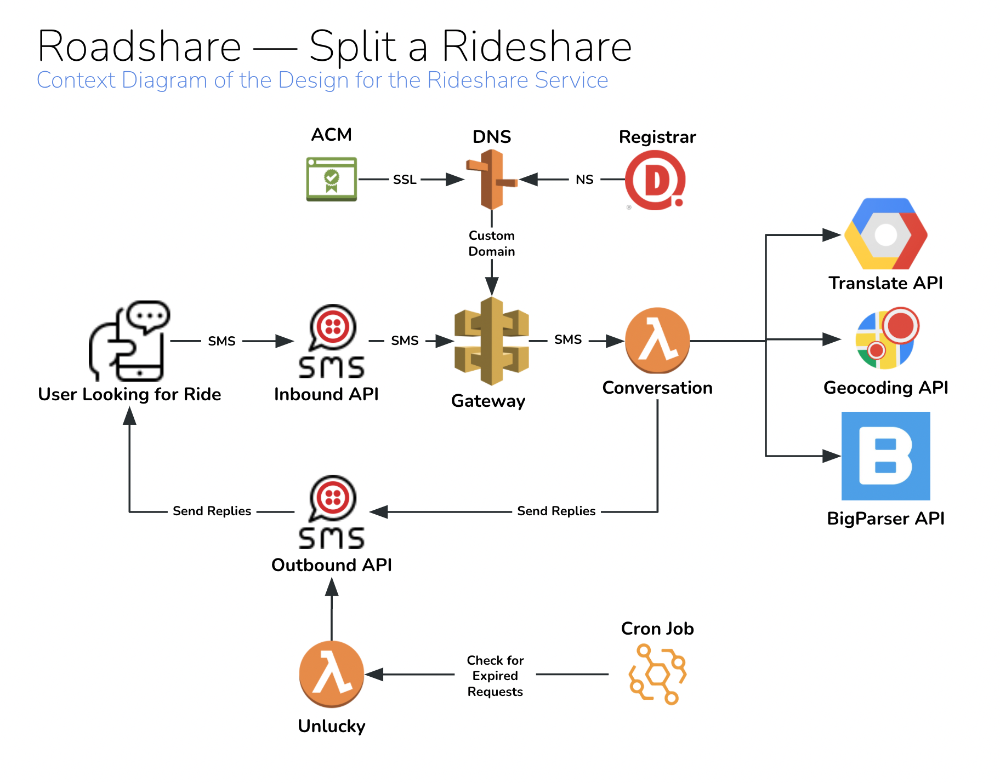

# Roadshare — Split a Rideshare

[![Stargazers][stars-shield]][stars-url]
[![Issues][issues-shield]][issues-url]

<p align="center">
  <a href="https://github.com/a-n-u-b-i-s/roadshare">
    
  </a>
</p>

<div id="top"></div>
<!-- TABLE OF CONTENTS -->
<details>
  <summary>Table of Contents</summary>
  <ol>
    <li>
      <a href="#about-the-project">About The Project</a>
      <ul>
        <li><a href="#built-with">Built With</a></li>
      </ul>
    </li>
    <li>
      <a href="#getting-started">Getting Started</a>
      <ul>
        <li><a href="#prerequisites">Prerequisites</a></li>
        <li><a href="#installation">Installation</a></li>
      </ul>
    </li>
    <li><a href="#usage">Usage</a></li>
    <li><a href="#roadmap">Roadmap</a></li>
    <li><a href="#contact">Contact</a></li>
  </ol>
</details>

<!-- ABOUT THE PROJECT -->
## About The Project

As college students, we oftentimes struggle to find reliable transportation that is both environmentally friendly and affordable. We found that when we used rideshare options such as Uber and Lyft, many of our friends were taking separate rides to the same destinations around the same times, wasting money and contributing to climate change.

With Roadshare, we automate this process into an easy-to-use service that helps cut the cost of a ride in half, while taking more cars off the road. In the process, we hope to create a more sustainable and affordable transportation option.

RoadShare allows individuals to request a "match," by texting basic information about their pickup location and destination. Our program, using the Twilio API & Google Maps Geocoding, determines if there is another rider requesting a similar ride that can join the ride, creating a "match". Similar rides are determined by pickup location, destination, and request times. The users then meet up at a central location and ride together.

This program also makes use of the Google Cloud API to accept and send texts in over 100 languages, making this service highly accessible to users of diverse backgrounds.

### Built With

* [Twilio APIs](https://www.twilio.com/docs/sms/api) — For Inbound & Outbound SMS Messages
* [Google Cloud Translate API](https://cloud.google.com/translate) — For Multi-lingual support
* [Google Maps Geocoding API](https://developers.google.com/maps/documentation/geocoding/overview) — To Get Geo Coordinates from Location Names
* [Google Maps Distance Matrix API](https://developers.google.com/maps/documentation/distance-matrix/overview) — To Get Walking Distance Between Two Locations
* [BigParser APIs](https://api.bigparser.com/) — Hosted Database as a Service w/ Built-In Search & Admin Grid UI
* [Typescript](https://www.typescriptlang.org/) — Main Programming Language
* [NodeJS](https://nodejs.org/en/) — Application Runtime in AWS Lambda
* [pnpm](https://pnpm.io/) — Package Manager
* [esbuild](https://esbuild.github.io/api/) — Build Tool
* [eslint](https://eslint.org/) + [prettier](https://prettier.io/) — Automated Code Linting & Formatting
* [husky](https://typicode.github.io/husky/#/) + [commitizen](https://github.com/commitizen/cz-cli) + [commitlint](https://commitlint.js.org/#/) — Automated Commit Message Linting & Git Hooks
* [Terraform](https://www.terraform.io/) — Repeatable Cloud Infrastructure Provisioning
* [AWS Lambda](https://aws.amazon.com/lambda/) — Serverless Compute Functions
* [AWS EventBridge](https://aws.amazon.com/eventbridge/) — To Automatically Schedule Lambdas to Run
* [API Gateway](https://aws.amazon.com/api-gateway/) — Exposing Webhooks to for inbound SMS from Twilio
* [AWS Route53](https://aws.amazon.com/route53/) — Domain DNS Records
* [AWS Certificate Manager](https://aws.amazon.com/certificate-manager/) — Domain SSL Certificates

<p align="right">(<a href="#top">back to top</a>)</p>

<!-- GETTING STARTED -->
## Getting Started

If you feel so inclined, you may follow the steps below to create your own version of this project.
To get your own copy up and running follow these "simple" example steps.

### Prerequisites

* Twilio Account
* Google Account with access to Google Cloud
* AWS Account
* BigParser Account
* Development software for the [Tech Stack](#built-with) listed above

### Installation

1. Clone the repo

   ```sh
   git clone https://github.com/a-n-u-b-i-s/roadshare.git
   ```

2. Install NPM packages with pnpm

   ```sh
   pnpm install
   ```

3. Upload `grids/Riders.csv` to BigParser

4. Create a Google Cloud Service Account with access to Cloud Translation APIs & store the json credentials it at `$PROJECT_ROOT/service-account.json`

5. Purchase a domain name to deploy to.

6. Purchase a Twilio Phone #

7. Add `secrets.auto.tfvars` file in the `terraform/development/compute` folder with the following content:

   ```terraform
     global_environment_variables={
        TWILIO_ACCOUNT_SID = "YOUR_TWILIO_ACCOUNT_SID",
        TWILIO_AUTH_TOKEN = "YOUR_TWILIO_AUTH_TOKEN",
        TWILIO_PHONE_NUMBER = "YOUR_TWILIO_PHONE_NUMBER",
        BP_AUTH = "YOUR_BIGPARSER_AUTH_ID",
        RIDERS_GRID_ID = "YOUR_BIGPARSER_GRID_ID",
        GOOGLE_APPLICATION_CREDENTIALS = "./service-account.json"
      }
      conversation_service_environment_variables={
        GOOGLE_MAPS_API_KEY = "YOUR_API_KEY_FOR_GOOGLE_MAPS_GEOCODING"
        GOOGLE_DISTANCE_API_KEY = "YOUR_API_KEY_FOR_GOOGLE_MAPS_DISTANCE_MATRIX_APIS"
      }
      unlucky_service_environment_variables={}
      account_id="YOUR_AWS_ACCOUNT_ID"
   ```

8. Add `secrets.auto.tfvars` file in the `terraform/development/api` folder with the following content:

   ```terraform
      domain_name="YOUR_DOMAIN_NAME"
   ```

9. Create s3 bucket inside the AWS management console. ENABLE BUCKET VERSIONING.

10. Modify `deploy` script to use this bucket name

    ```sh
    -backend-config="bucket=YOUR-BUCKET-NAME" \
    ```

11. Compile the typescript code

    ```sh
    pnpm run build
    ```

12. Deploy infrastructure. If on Windows, add `${LOCAL_PATH}\Git\bin\sh.exe` to PATH and run the deploy bash script using `sh`. Other OSes can simply run the deploy bash script directly, which will be what is shown in the following steps. This installation will use the development environment; the commands for production are similar.

13. Deploy compute state

    ```sh
    ./deploy development compute init
    ./deploy development compute plan
    ./deploy development compute apply
    ```

14. Deploy api state

    ```sh
    ./deploy development api init
    ./deploy development api plan
    ./deploy development api apply
    ```

15. Update Domain NS Records to match NS Records in Route53 in the newly created Hosted Zone while `./deploy development api apply` runs Certificate Manager Verification

16. Configure Twilio Phone # Number Incoming SMS Webhook to `https://YOUR_DOMAIN_NAME/sms`

17. For a production deployment, repeat steps 5-16, but replace development with production in each step wherever it appears

<p align="right">(<a href="#top">back to top</a>)</p>

<!-- USAGE EXAMPLES -->
## Usage

Application Features:

* Text 'Find Me a Ride' in any language to Roadshare's Phone #
* Roadshare remembers previous users by the name they provide
* Provide your Pickup Location (will be approximated via Geocoding)
* Provide your Destination Location (will be approximated via Geocoding)
* Get notified immediately if you matched with anyone
* Default 10 minute window for you to be searching for other matches
* After 10 minutes of no matches, your request expires & you are sent an apology text
* Users are matched to minimize total walking distance between both Pickups & both Destinations
* Sending "RESET" will reset your conversation flow & language
* Profane names are automatically censored on outgoing messages

Below is a "simple" architecture diagram.

<p align="center">
  
</p>

Each File & Folder Explained:

* `.husky` — Folder containing git hooks which are injected on `pnpm install`
* `dist` — Folder created on `pnpm run build` with transpiled code & service-account.json for each lambda function.
* `grids` — Folder with a `.csv` file for each BigParser Grid needed
* `images` — Folder with images to be used in this README
* `src` — Primary Source Code Folder
* `src/common` — Folder for Code Shared between Lambda Functions
* `src/scripts` — Folder for Code that is to be run locally on a developers machine'
* `src/services` — Folder for Lambda Function Services
* `src/services/*` — Folder for the code for a specific Lambda Function
* `src/services/*/index.ts` — Exported `main` Function is the Code Execution starting point for each Lambda Function
* `terraform` — Folder for all Terraform Configuration Files
* `terraform/modules` — Folder for any custom Terraform Modules
* `terraform/development` — Folder for Terraform Config for the Development Environment
* `terraform/production` — Folder for Terraform Config for the Production Environment
* `terraform/modules/lambda` — Folder for Config for Custom Terraform Lambda Module
* `terraform/!**modules**/compute` — Folder for all compute related Terraform Config in a given environment
* `terraform/!**modules**/api` — Folder for all api related Terraform Config in a given environment
* `terraform/!**modules**/*/main.tf` — File for environment & state specific Terraform Configuration
* `terraform/!**modules**/*/secrets.auto.tfvars` — File with Application Secrets
* `.env` — File with Application Secrets for Local Scripts
* `.eslintcache` — File generated by eslint to improve linting performance
* `.gitignore` — File with list of file patterns not to be committed to GitHub
* `deploy` — Deploy Shell Script used to simplify using Terraform CLI
* `package.json` — File will all of the app level info, dependencies, & dev config
* `pnpm-lock.yaml` — File generated by `pnpm install`to improve pnpm performance
* `README.md` — This File :)
* `service-account.json` — File added by used with Service Account Credentials for Google Cloud Translation
* `tsconfig.json` — File with configuration for Typescript

After making any code changes to existing services in the `src/services` folder, deploy your changes with:

```sh
pnpm run build
./deploy development compute plan
./deploy development compute apply
```

and commit with

```sh
git add .
git cz
```

this committing practice will ensure proper commit messages with proper code linting.

Adding new services requires a through understanding of terraform & how it has been setup in this repo.
But it will usually involve updating `terraform/development/compute/main.tf` or  `terraform/production/compute/main.tf`

Any triggers for the Lambda Functions should be added in either `terraform/development/compute/main.tf` or  `terraform/production/compute/main.tf` depending on the appropriate environment.

<!-- ROADMAP -->
## Roadmap

We plan to implement a number of new features: safety/security protocols, a mobile application interface, preference allowances, and integration with rideshare APIs.

Safety and Security: It is important to add security measures to ensure the safety of our users. We plan to implement photo-ID verification in a future iteration, for everyone's protection.

Mobile Application: User preferences and profiles may change. We would eventually move from text implementation to mobile app implementation so that it's easy for users to visualize preferences and requests.

Preference Allowances: Ask users how long they're willing to wait to find a match, or how far they're willing to walk, which helps better meet individual needs. Modify response and flow logic accordingly.

Integration with Rideshare APIs: Allow users to book directly through the mobile app, by integrating an Uber/Lyft API within the Mobile App interface. This will increase convenience and increase retention.

CI / CD Deployments: Adding Automated Unit & Integration Tests & only allowing deployments to development or production from a CI / CD provider would streamline the development process as we make more updates & potentially bring on more contributors in the future.

<p align="right">(<a href="#top">back to top</a>)</p>

<!-- CONTACT -->
## Contact

Anubis - anubis@intellibus.com | aw3852@nyu.edu

Neil Kothari - nak5c@viginia.edu

Kate Chadwick - zur5ms@viginia.edu

Abby Dhakal - wgq3bt@viginia.edu

<p align="right">(<a href="#top">back to top</a>)</p>

[forks-shield]: <https://img.shields.io/github/forks/a-n-u-b-i-s/roadshare.svg?style=flat-square>
[forks-url]: <https://github.com/a-n-u-b-i-s/roadshare/network/members>
[stars-shield]: <https://img.shields.io/github/stars/a-n-u-b-i-s/roadshare.svg?style=flat-square>
[stars-url]: <https://github.com/a-n-u-b-i-s/roadshare/stargazers>
[issues-shield]: <https://img.shields.io/github/issues/a-n-u-b-i-s/roadshare.svg?style=flat-square>
[issues-url]: <https://github.com/a-n-u-b-i-s/roadshare/issues>
